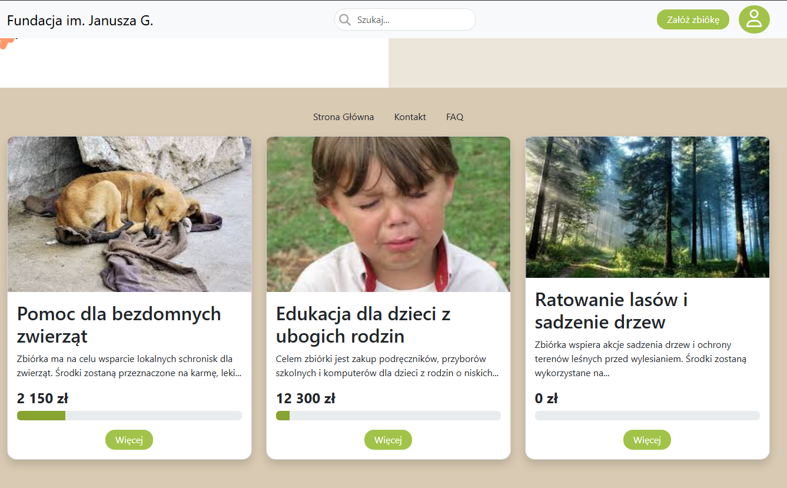
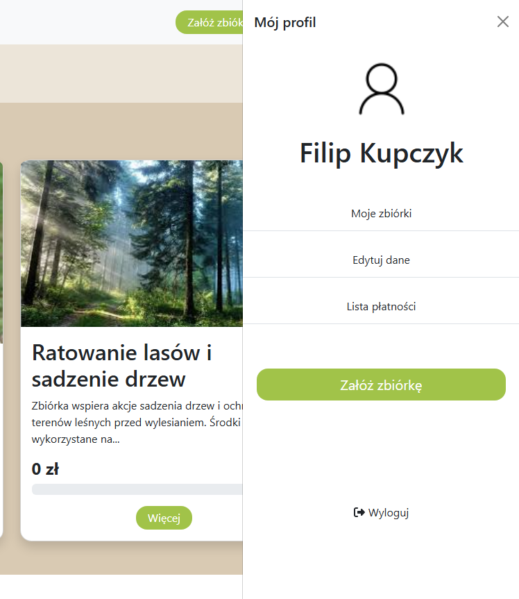
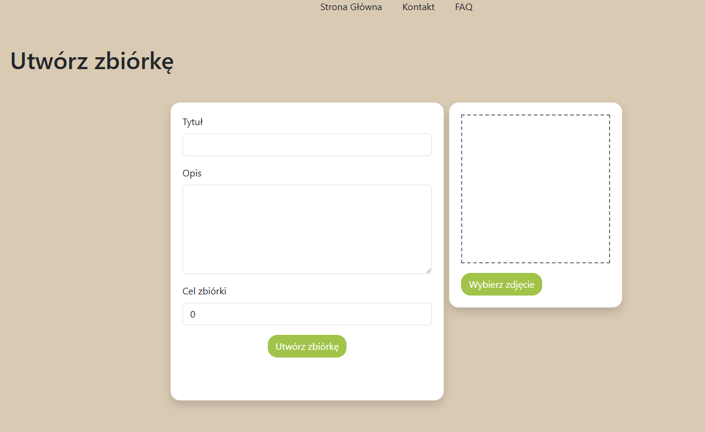
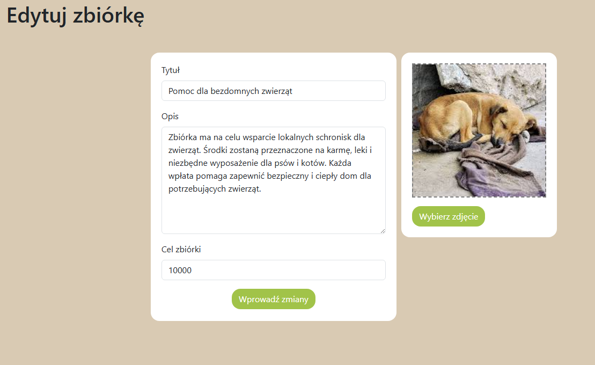
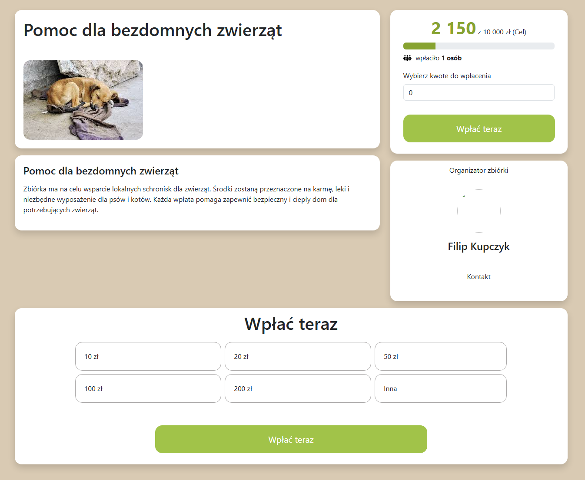

## Strona zarządzająca zbiórkami charytatywnymi

Aplikacja webowa do tworzenia, edycji i wspierania zbiórek charytatywnych online.
Użytkownicy mają opcje zakładania, edycji własnych zbiórek, oraz dokonywania oraz śledzenia wpłat na osobne zbiórki.
Została wprowadzona funkcjonalność administratora, który może zarządzać wszystkimi zbiórkami utworzonymi na stronie.

## Funkcjonalności

- Zakładnie i edycja zbiórek założonych przez danego użytkownika
- Przeglądania wszystkich zbiórek
- Dokonywanie wpłat oraz śledzenie postępów wypełnienia celu każdej zbiórki (zaimplementowane paski postępów)
- Liczba wspierających każdą zbiórkę
- Możliwość sprawdzenia wszystkich wpłat dokonanych z danego konta
- Profile użytkowników z możliwością edycji zbiórek danego użytkownika oraz jego danych
- Profil administratora z możliwością edycji oraz usunięcia wszystkich zbiórek na stronie

## Technologie

- **Backend:** Python 3.10, FastAPI, SQLAlchemy, PostgreSQL  
- **Frontend:** Vue.js 3, Axios, Bootstrap 5, Babel  
- **Baza danych:** PostgreSQL  
- **Inne:** Pydantic, Uvicorn, Font Awesome 

## Widoki aplikacji

- strona głowna

- profil użytkownika

- utworzenie zbiórki

- edycja zbiórki

- strona zbiórki

## Instalacja i uruchomienie

## Backend

1. Zainstaluj Pythona 3.10
2. Utworzenie wirtualnego środowiska:
python -m venv venv
3. Aktywowanie środowiska:
venv\Scripts\activate
4. Zainstalowanie wymaganych pakietów:
pip install -r requirements.txt
5. Konfiguracja pliku .env:
6. Utworzenie bazy danych w PostgressSQL o nazwie fastapi
7. Uruchomienie backendu:
uvicorn app.main:app --reload

## Frontend

1.Instalacja zależności:
npm install
2. Budowa frontednu:
npm run build
3. Uruchomienie frontendu:
npm run serve
